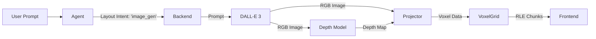

# Image-to-Voxel Generation Pipeline Research & Implementation Plan

**Status**: Proposed
**Date**: 2024-05-22
**Author**: Voxelito Engineering

## 1. Executive Summary

This document outlines a novel approach to voxel scene generation by leveraging 2D generative AI combined with monocular depth estimation. Instead of generating voxels directly via Large Language Models (LLMs) or procedural algorithms—which often struggle with complex spatial coherence and organic details—we propose a pipeline that first "dreams" a 2D image of the scene, estimates its 3D structure via a depth map, and projects this data into a voxel grid. This method promises to significantly enhance the aesthetic quality, variety, and "dream-like" capability of Voxelito scenes.

## 2. Problem Statement

The current Voxelito pipeline relies on:
1.  **Direct LLM Shape Generation**: Good for simple, structural objects (boxes, pyramids) but fails at organic shapes (creatures, complex terrain).
2.  **Procedural Algorithms (WFC)**: Excellent for structured layouts (cities) but lacks semantic variety and specific artistic control.

**Limitations**:
-   **Lack of Organic Detail**: LLMs struggle to output coordinates for thousands of voxels to form a realistic organic shape (e.g., a dragon or a specific landmark).
-   **Visual Fidelity**: Voxel scenes often look "blocky" in a primitive way, rather than stylistically detailed.
-   **Prompt Adherence**: It is difficult to get an LLM to "draw" a specific visual style in 3D coordinates.

## 3. Proposed Solution: "Dream & Project"

We propose a multi-stage pipeline:
1.  **Text-to-Image**: Use a state-of-the-art 2D generator (e.g., DALL-E 3) to create a high-fidelity visualization of the user's request.
2.  **Depth Estimation**: Apply a robust Monocular Depth Estimation model (e.g., Depth Anything V2) to generate a dense depth map from the image.
3.  **3D Projection (Ray Casting)**: Mathematically unproject each pixel $(u, v)$ with its depth $d$ into 3D space $(x, y, z)$.
4.  **Voxelization**: Quantize the resulting point cloud into the Voxelito grid, mapping pixel colors to the nearest available voxel palette material.

### 3.1 Key Advantages
-   **High Fidelity**: Leveraging DALL-E 3 allows for incredible visual variety (lighting, composition, style).
-   **Robust Structure**: Depth models provide surprisingly accurate relative depth, ensuring objects have 3D volume.
-   **Scalability**: The pipeline is resolution-independent; higher res images yield higher res voxel models.

## 4. Technical Architecture

### 4.1 New Components

1.  **`ImageGenerator` Service**:
    -   Wrapper around `openai.images.generate`.
    -   Handles prompt engineering to enforce "Isometric View", "White Background", and "Orthographic Projection" to minimize perspective distortion.

2.  **`DepthEstimator` Service**:
    -   Local or API-based inference using `transformers`.
    -   Recommended Model: `depth-anything/Depth-Anything-V2-Small-hf` (Fast, lightweight, high accuracy).

3.  **`VoxelProjector` Engine**:
    -   **Input**: RGB Image ($W \times H$), Depth Map ($W \times H$), Camera Intrinsics ($K$).
    -   **Process**:
        1.  Normalize Depth to metric scale (heuristic or learned).
        2.  Unproject pixels to Point Cloud.
        3.  Apply Extrinsics (Rotation/Translation) for multi-view merging.
        4.  Quantize to Voxel Grid.
    -   **Output**: Sparse Voxel Octree or List of `{pos, color}`.

### 4.2 Data Flow



## 5. Detailed Methodology

### 5.1 Image Generation Strategy
To ensure successful voxelization, the input image must be compatible with a voxel grid structure.
-   **Prompting**: Append keywords: *"Isometric view, diorama, white background, high contrast, 3D render style, orthographic"* to reduce extreme perspective foreshortening.
-   **Resolution**: 1024x1024 (Standard DALL-E 3).

### 5.2 Depth Estimation & Calibration
Depth maps from models like MiDaS or Depth Anything are **relative** (disparity), not absolute metric depth.
-   **Inversion**: $Z_{rel} = 1 / d_{pred}$ (if disparity) or direct usage if metric-aligned.
-   **Normalization**: Map the min/max depth values to the Voxelito scene bounds (e.g., scene depth 100 voxels).
    $$ Z_{voxel} = (Z_{raw} - Z_{min}) / (Z_{max} - Z_{min}) \times SceneDepth $$

### 5.3 Projection Math
Given pixel $(u, v)$ and depth $z$:
Assume Pinhole Camera model with field of view $\theta$ (approx 30-45 degrees for "isometric-like" look).

$$ x = \frac{(u - c_x) \cdot z}{f_x}, \quad y = \frac{(v - c_y) \cdot z}{f_y} $$

Where $f_x, f_y$ are focal lengths derived from FOV: $f = \frac{W}{2 \tan(\theta/2)}$.

### 5.4 Multi-View Exploration
To solve occlusion (holes behind objects), we can generate multiple views:
1.  **Front View**: Primary generation.
2.  **Back View** (Optional): Prompt "Back view of [Subject]".
3.  **Merging**: Project both point clouds into the same global coordinate system.
    -   Requires precise alignment (hard with generative AI).
    -   **Recommendation**: Start with **Single View + Thickness Heuristic**. Extrude the visible surface backwards by a fixed amount or generate a "bas-relief" style voxel object which looks perfect from the front.

## 6. Implementation Roadmap

### Phase 1: Prototype (Local Script)
**Goal**: Validate the Image+Depth->Voxel pipeline in isolation.
-   **Tasks**:
    1.  Create `tools/research_image_to_voxel.py`.
    2.  Implement `DepthAnything` using `transformers`.
    3.  Implement basic projection logic.
    4.  Visualize result using `matplotlib` (3D scatter) or export `.vox` / `.json`.

### Phase 2: Backend Integration
**Goal**: Connect to the API.
-   **Tasks**:
    1.  Add dependencies: `transformers`, `torch` (CPU version for size), `Pillow`, `numpy`.
    2.  Create `api/pipeline/image_gen.py`.
    3.  Add `layout_intent="image"` handling in `api/index.py`.
    4.  Implement color mapping (RGB -> Voxel Palette closest match).

### Phase 3: Advanced Projection
**Goal**: Improve quality.
-   **Tasks**:
    1.  Implement "Void Filling": Fill gaps between voxels to prevent "sieve" effect.
    2.  Implement "Background Removal": Threshold depth or color (white background) to ignore empty space.
    3.  Optimize performance (caching models).

## 7. Verification Plan

### 7.1 Unit Tests
-   **`test_projection_math`**: Verify unprojection logic maps center pixel to $(0,0,z)$.
-   **`test_palette_matching`**: Ensure RGB colors map to the nearest allowed voxel ID.

### 7.2 Integration Tests
-   **End-to-End**: Mock DALL-E/Depth response and verify `api/index.py` returns valid RLE chunks.

### 7.3 Visual Verification
-   Generate a "Red Sphere".
-   Verify the resulting voxel scene contains a spherical arrangement of red voxels.
-   Check side-profile to evaluate depth distortion.

## 8. Requirements & Dependencies

To implement this, we need to add the following to `api/requirements.txt`:
```text
numpy
Pillow
transformers
torch --extra-index-url https://download.pytorch.org/whl/cpu  # Use CPU version to keep image size manageable
scipy
```

## 9. Conclusion

This approach represents a paradigm shift for Voxelito. By decoupling scene "imagination" (Image Gen) from "construction" (Voxelization), we can support vastly more complex and creative user requests, transforming Voxelito from a "block builder" into a "3D dream visualizer".
