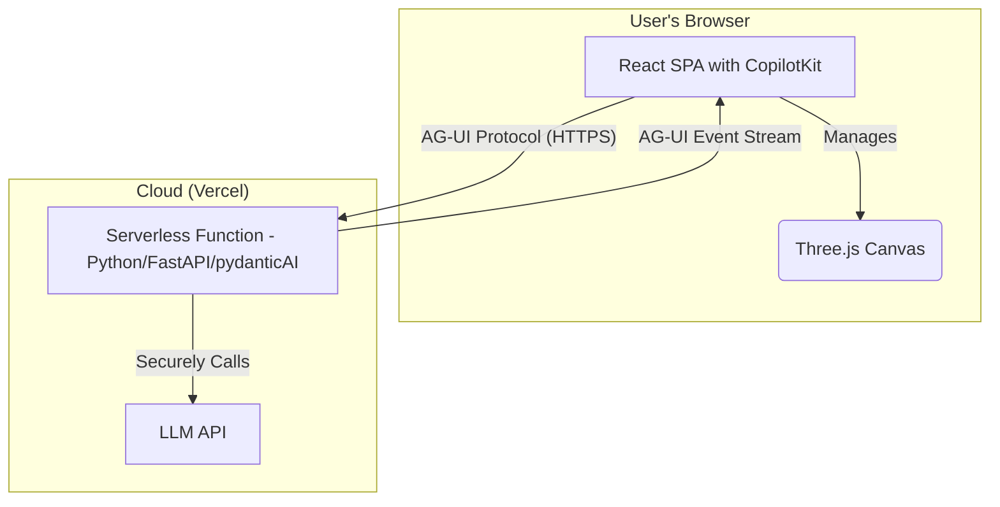

# Project Memory: Voxel Diorama Generator

This document serves as a centralized, living record of the project's state, architecture, key decisions, and implementation learnings. Its purpose is to ensure consistency and adherence to best practices throughout the development lifecycle.

## 1. Project Overview & Goal
The project is a web-based platform for generating and editing 3D voxel diorama scenes. The core feature is a conversational AI interface that allows users to create and modify scenes through natural language chat prompts. The platform targets a broad audience, from hobbyists and gamers to professional designers, by making 3D content creation intuitive and accessible.

**Branding Update:** The project is now branded as **VOXELITO**, featuring a dark, retro-futuristic "cyber-voxel" aesthetic. Key visual elements include deep purple/blue backgrounds, neon accents, and a realistic "neon bulb" logo with flicker effects.

## 2. System Architecture
The application follows a decoupled client-server model:

-   **Frontend (Client):** A rich Single Page Application (SPA) responsible for all user-facing elements. This includes the 3D scene rendering, user interaction (camera controls, voxel selection), and the chat UI.
-   **Backend (Server):** A lightweight, stateless API service that acts as a secure proxy to the AI model (LLM). Its sole purpose is to receive prompts from the client, communicate with the LLM, and return the structured scene data.
-   **Deployment:** The entire application is hosted on Vercel, with the frontend as a static site and the backend API deployed as a serverless function.

## 3. Technology Stack
-   **Frontend:**
    -   **Framework:** React 18 (with Vite and TypeScript)
    -   **3D Rendering:** `three`
    -   **Agent Communication:** `@copilotkit/react-core`, `@copilotkit/react-ui`
-   **Backend:**
    -   **Runtime:** Python 3.9+
    -   **Framework:** `FastAPI`
    -   **AI Agent:** `pydantic-ai`
-   **Deployment:**
    -   **Platform:** Vercel

## 4. Implementation Plan & Progress
The project follows the detailed plan outlined in `docs/06_PLAN.md`.

-   **[✓] Phase 1: Project Foundation & Core Setup**
-   **[✓] Phase 2: Voxel Engine and API Development**
-   **[✓] Phase 3: UI and Feature Integration**
    -   **[✓] Step 11:** Backend LLM Integration
    -   **[✓] Step 12:** Implement Scene State Update via Chat Response
    -   **[✓] Step 12b:** UI Overhaul (Voxelito Branding, Neon Logo, Responsiveness)
-   **[ ] Phase 4: Finalization and Deployment**

## 5. Development Process & Key Learnings

### 5.1. PRP (Project Realization Plan) Process
-   Each implementation step from the plan is documented with a PRP markdown file in the `PRPs/` directory.
-   The naming convention is `P<Phase_Number>S<Step_Number>-<Description>.md`.

### 5.2. Backend LLM Integration
-   The Python backend in `api/` uses `pydantic-ai` to interface with LLMs.
-   API keys are managed using a `.env.local` file in the `api/` directory.

### 5.3. Frontend Verification
-   Frontend changes are verified using Playwright. The project includes a `verify.spec.js` script for end-to-end testing.
-   Playwright is installed as a dev dependency (`@playwright/test`), and browsers must be installed via `npx playwright install`.

### 5.4. Vite Configuration
-   The `vite.config.ts` file is configured to polyfill the `process` variable to prevent `ReferenceError: process is not defined`.
-   For local development, the Vite server is configured to proxy requests from `/api` to the backend server running on `http://localhost:8000`.

### 5.5. React & Three.js Integration
-   **Suspense Deadlock:** A React component that triggers Suspense must be wrapped in a `<Suspense>` boundary to avoid silent rendering failures.
-   **Callback Refs for Imperative Libraries:** When integrating imperative libraries like `three.js`, use the `useCallback` (callback ref) pattern. **Crucially, callback refs should not return a value.** A common mistake is to return a cleanup function from the callback. This violates React's expectations and can cause subtle rendering bugs. Cleanup logic should be handled in a separate `useEffect` hook.

### 5.6. TypeScript and Vite
-   **Type-Only Imports:** When a file exports only TypeScript `interface`s or `type`s, it must be imported using `import type`.
-   **Web Workers:** TypeScript-based Web Workers must be placed in the `src` directory and instantiated using the `new URL(...)` pattern.

### 5.7. Voxel Engine
-   The core data structures for the voxel engine are defined in `src/types.ts`.
-   The greedy meshing algorithm is offloaded to a Web Worker to keep the main UI thread responsive.

### 5.8. CopilotKit Integration
-   **Dual-Protocol Backend:** The CopilotKit integration requires a backend that can handle both a standard `JSONResponse` (for the initial `availableAgents` discovery) and a `StreamingResponse` (for chat).
-   **Client-Side Message Parsing (`useCopilotChat`):** Due to backend limitations (the custom Pydantic agent does not support the OpenAI Tool Calling protocol), the frontend cannot use `useCopilotAction`. Instead, it uses a "Message Listener" pattern with the `useCopilotChat` hook. A `useEffect` hook monitors the chat's `isLoading` state. When a message is complete, the frontend attempts to parse the assistant's last message content as JSON and updates the application state if it's valid scene data.
-   **Resolved UI Rendering Failure:** The previous issue where `<CopilotChat>` was failing to render (hidden by overflow/height issues) was resolved by switching to `<CopilotPopup>`. This component floats above the UI and is more robust for this layout. The chat UI has been heavily customized via CSS to match the "Voxelito" dark theme.

### 5.9. Procedural Graphics & Animation
-   **Procedural Neon Logo:** Instead of using static raster images, the project utilizes procedurally generated SVG components for the logo. This allows for:
    -   Infinite scalability without pixelation.
    -   Dynamic coloring (tinting) via CSS props or classes.
    -   Advanced CSS animations (flicker, glitch) that can target specific parts of the SVG (stroke vs fill).
-   **CSS Filters for Glow:** The "neon glow" effect is achieved using multiple SVG `feGaussianBlur` layers combined with `drop-shadow` filters in CSS. This creates a realistic light bleed effect that is performant and controllable.
