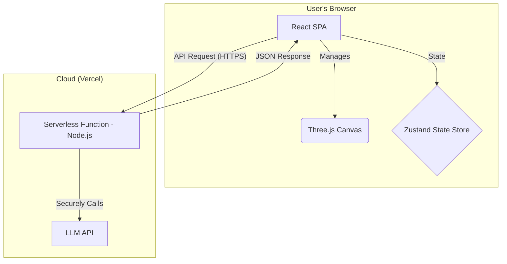

# Project Memory: Voxel Diorama Generator

This document serves as a centralized, living record of the project's state, architecture, key decisions, and implementation learnings. Its purpose is to ensure consistency and adherence to best practices throughout the development lifecycle.

## 1. Project Overview & Goal
The project is a web-based platform for generating and editing 3D voxel diorama scenes. The core feature is a conversational AI interface that allows users to create and modify scenes through natural language chat prompts. The platform targets a broad audience, from hobbyists and gamers to professional designers, by making 3D content creation intuitive and accessible.

## 2. System Architecture
The application follows a decoupled client-server model:

-   **Frontend (Client):** A rich Single Page Application (SPA) responsible for all user-facing elements. This includes the 3D scene rendering, user interaction (camera controls, voxel selection), and the chat UI.
-   **Backend (Server):** A lightweight, stateless API service that acts as a secure proxy to the AI model (LLM). Its sole purpose is to receive prompts from the client, communicate with the LLM, and return the structured scene data.
-   **Deployment:** The entire application is hosted on Vercel, with the frontend as a static site and the backend API deployed as a serverless function.

## 3. Technology Stack
-   **Frontend:**
    -   **Framework:** React (with Vite and TypeScript)
    -   **3D Rendering:** `three`, `@react-three/fiber`, `@react-three/drei`
    -   **State Management:** `zustand`
-   **Backend:**
    -   **Runtime:** Node.js
    -   **Framework:** `express`
-   **Deployment:**
    -   **Platform:** Vercel

## 4. Implementation Plan & Progress
The project follows the detailed plan outlined in `docs/06_PLAN.md`.

-   **[✓] Phase 1: Project Foundation & Core Setup**
    -   **[✓] Step 1:** Frontend Project Scaffolding
    -   **[✓] Step 2:** Install Core Frontend Dependencies
    -   **[✓] Step 3:** Backend API Setup
    -   **[ ] Step 4:** Basic 3D Scene Setup
    -   **[ ] Step 5:** State Management (Zustand)
-   **[ ] Phase 2: Voxel Engine and API Development**
-   **[ ] Phase 3: UI and Feature Integration**
-   **[ ] Phase 4: Finalization and Deployment**

## 5. Development Process & Key Learnings

### 5.1. PRP (Project Realization Plan) Process
-   Each implementation step from the plan must be documented with an `INITIAL` and a `REPORT` markdown file in `PRPs/reports/`.
-   The naming convention is `P<Phase_Number>S<Step_Number>-<TYPE>.md` (e.g., `P1S1-INITIAL.md`).

### 5.2. Critical: Atomic Commits & Branching
-   **Core Rule:** Every PRP step must be executed on its own dedicated feature branch.
-   **Rationale:** Code reviews have repeatedly emphasized that commits must be **atomic**. A submission should only contain the specific changes related to the single step being implemented. Bundling work from multiple steps into one commit is not acceptable.
-   **Workflow:**
    1.  Start a new branch for the step (e.g., `feature/p1s4-scene-setup`).
    2.  Complete the work for that single step.
    3.  Submit the changes.
    4.  Merge, and then start the next step from a fresh branch.

### 5.3. Minor Technical Learnings
-   The command `npm init -y --prefix <dir>` can have unintended side effects and may modify the root `package.json`. The safer approach for initializing a sub-project is to create the `package.json` manually or `cd` into the directory first.
