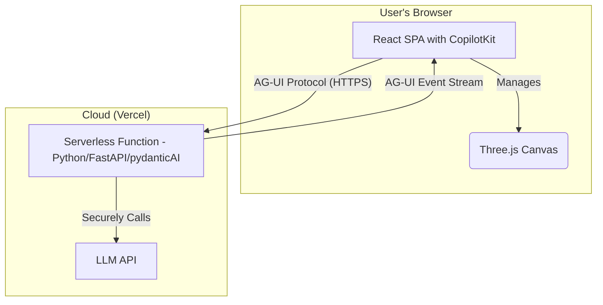

# Project Memory: Voxel Diorama Generator

This document serves as a centralized, living record of the project's state, architecture, key decisions, and implementation learnings. Its purpose is to ensure consistency and adherence to best practices throughout the development lifecycle.

## 1. Project Overview & Goal
The project is a web-based platform for generating and editing 3D voxel diorama scenes. The core feature is a conversational AI interface that allows users to create and modify scenes through natural language chat prompts. The platform targets a broad audience, from hobbyists and gamers to professional designers, by making 3D content creation intuitive and accessible.

## 2. System Architecture
The application follows a decoupled client-server model:

-   **Frontend (Client):** A rich Single Page Application (SPA) responsible for all user-facing elements. This includes the 3D scene rendering, user interaction (camera controls, voxel selection), and the chat UI.
-   **Backend (Server):** A lightweight, stateless API service that acts as a secure proxy to the AI model (LLM). Its sole purpose is to receive prompts from the client, communicate with the LLM, and return the structured scene data.
-   **Deployment:** The entire application is hosted on Vercel, with the frontend as a static site and the backend API deployed as a serverless function.

## 3. Technology Stack
-   **Frontend:**
    -   **Framework:** React 18 (with Vite and TypeScript)
    -   **3D Rendering:** `three`
    -   **Agent Communication:** `@copilotkit/react-core`, `@copilotkit/react-ui`
-   **Backend:**
    -   **Runtime:** Python 3.9+
    -   **Framework:** `FastAPI`
    -   **AI Agent:** `pydantic-ai`
-   **Deployment:**
    -   **Platform:** Vercel

## 4. Implementation Plan & Progress
The project follows the detailed plan outlined in `docs/06_PLAN.md`.

-   **[✓] Phase 1: Project Foundation & Core Setup**
    -   **[✓] Step 1:** Frontend Project Scaffolding
    -   **[✓] Step 2:** Install Core Frontend Dependencies
    -   **[✓] Step 3:** Backend API Setup
    -   **[✓] Step 4:** Basic 3D Scene Setup
    -   **[✓] Step 5:** Chat UI Setup (CopilotKit)
-   **[✓] Phase 2: Voxel Engine and API Development**
    -   **[✓] Step 7:** Core API Endpoint (`/api/generate`)
    -   **[✓] Step 8:** Voxel Data Structures
    -   **[✓] Step 9:** Voxel Meshing Web Worker
    -   **[✓] Step 10:** Voxel Scene Manager
    -   **[✓] Step 10b:** Fix Silent Rendering Failure
-   **[ ] Phase 3: UI and Feature Integration**
-   **[ ] Phase 4: Finalization and Deployment**

## 5. Development Process & Key Learnings

### 5.1. PRP (Project Realization Plan) Process
-   Each implementation step from the plan is documented with a PRP markdown file in the `PRPs/` directory.
-   The naming convention is `P<Phase_Number>S<Step_Number>-<Description>.md` (e.g., `P1S4-Basic-3D-Scene.md`).

### 5.2. Frontend Verification
-   Frontend changes are verified using Playwright scripts.
-   A temporary verification script is created in `/home/jules/verification` to take a screenshot of the changes.
-   The screenshot is then visually inspected to confirm the changes are correct.

### 5.3. Vite Configuration
-   The `vite.config.ts` file is configured to polyfill the `process` variable to prevent `ReferenceError: process is not defined` in the browser. This is a common issue with Vite 5. The configuration is `define: { 'process.env': {} }`.
-   For local development, the Vite server is configured to proxy requests from `/api` to the backend server running on `http://localhost:8000`. This avoids CORS issues and simplifies frontend code.
-   Vite's cache may need to be cleared (`npm run dev -- --force`) after major configuration changes, such as modifying how TypeScript types are imported, to avoid persistent module resolution errors.

### 5.4. React & Three.js Integration
-   **Suspense Deadlock:** A React component that triggers Suspense (e.g., by dynamically loading a worker) must be wrapped in a `<Suspense>` boundary. Failure to do so can cause the entire application to suspend its rendering process, resulting in a silent failure (blank screen).
-   **Callback Refs for Imperative Libraries:** When integrating imperative libraries like `three.js` that need a reference to a DOM element, the `useCallback` (callback ref) pattern is more reliable than `useRef` and `useEffect`. A callback ref guarantees that the initialization logic runs as soon as the DOM node is available, avoiding timing issues where `ref.current` might be `null`.

### 5.5. TypeScript and Vite
-   **Type-Only Imports:** When a file exports only TypeScript `interface`s or `type`s, it must be imported using `import type`. These constructs are erased during compilation, so a standard `import` will fail at runtime because the module has no exports.
-   **Web Workers:** TypeScript-based Web Workers must be placed in the `src` directory to be compiled by Vite. They should be instantiated using the `new URL(...)` pattern: `new Worker(new URL('../path/to/worker.ts', import.meta.url), { type: 'module' });`.

### 5.6. Voxel Engine
-   The core data structures for the voxel engine are defined in `src/types.ts`.
-   The computationally intensive greedy meshing algorithm is offloaded to a Web Worker to keep the main UI thread responsive.
